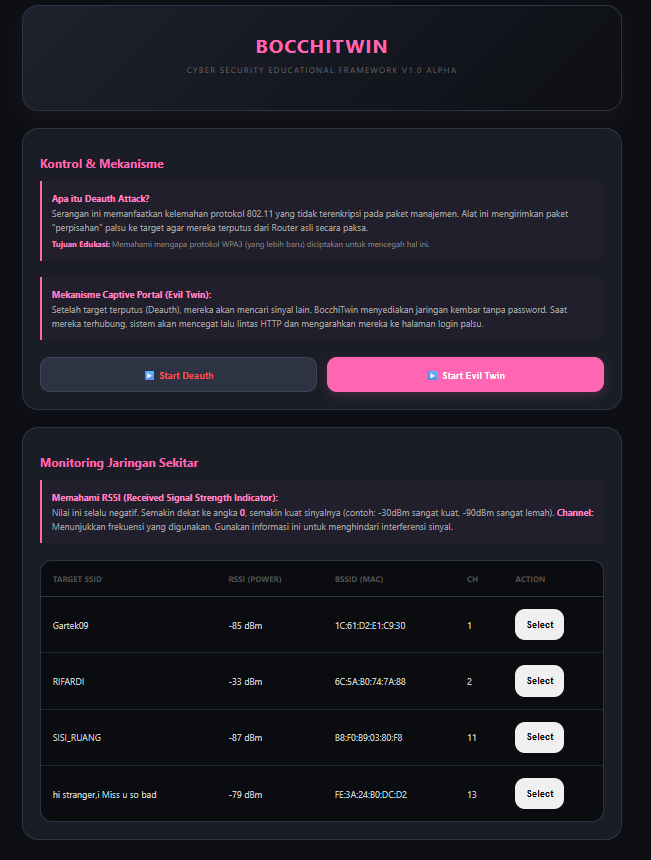
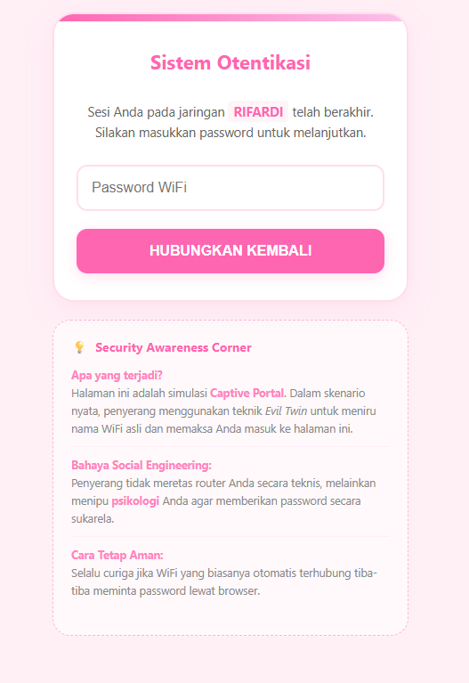

# BocchiTwin v1.0 Alpha
> **Educational WiFi Security Tool | Deauther & Evil Twin Simulation**


## &#9636; Tentang Proyek
**BocchiTwin v1.0 Alpha** adalah platform eksperimental berbasis ESP8266 yang dirancang untuk mempelajari dua vektor serangan utama dalam jaringan WiFi: **Deauthentication Attack** dan **Evil Twin Simulation**. Proyek ini bertujuan untuk menunjukkan betapa rentannya protokol 802.11 terhadap gangguan dari luar jika tidak dikonfigurasi dengan fitur keamanan modern (seperti PMF).

## Materi Pembelajaran
Melalui alat ini, kamu bisa mempelajari dua konsep penting:

1. **Deauthentication Attack (Pemutusan Koneksi):**
   * Alat ini mengirimkan paket "deauth" ke perangkat target dengan memalsukan alamat MAC dari router asli.
   * Target akan mengira router menyuruhnya untuk putus koneksi, sehingga perangkat target akan terputus secara otomatis.
   * Ini membuktikan bahwa standar WiFi lama sangat mudah diganggu tanpa perlu mengetahui password-nya sama sekali.

2. **Evil Twin Simulation (WiFi Kembar):**
   * Setelah target terputus, alat ini membuat WiFi baru dengan nama (SSID) yang sama persis.
   * Kita mempelajari aspek **Social Engineering**, di mana pengguna yang bingung akan cenderung memilih WiFi tanpa password yang namanya sama untuk kembali terhubung.
   * Di sini kamu belajar betapa bahayanya menghubungkan perangkat ke jaringan publik yang tidak dikenal.

## Fitur Utama
* **Selective Deauth:** Pilih perangkat tertentu atau seluruh jaringan untuk diputus koneksinya.
* **Network Scanner:** Mendeteksi SSID dan memantau kekuatan sinyal (RSSI) di sekitar.
* **Bocchi-Pink Portal:** Halaman login palsu responsif untuk menguji kesadaran keamanan pengguna.
* **Log Data:** Menyimpan dan menampilkan hasil input dari portal secara real-time.

## Struktur File
```text
BocchiTwin-v1/
├── BocchiTwin.ino       # Core Logic & Setup
├── config.h             # Administrative Config
├── functions.h          # Deauth & Scanning Engine
├── pages.h              # Bocchi Pink UI (HTML/CSS)
└── README.md            # Dokumentasi Proyek
```

### Bagian 2: Panduan Instalasi & Penggunaan

## Panduan Instalasi

### 1. Persiapan Hardware & Software
* **Hardware:** Gunakan modul berbasis **ESP8266** apa saja (NodeMCU, Wemos D1, dll) selama didukung oleh [Spacehuhn Deauther SDK](https://github.com/spacehuhntech/esp8266_deauther/wiki/Installation).
* **Driver:** Pastikan driver USB-to-Serial (seperti CH340 atau CP2102) sudah terinstal agar board terbaca.
* **Arduino IDE:** Gunakan versi terbaru untuk hasil kompilasi yang stabil.

### 2. Konfigurasi Arduino IDE
* Masuk ke **File** > **Preferences**.
* Tambahkan URL berikut pada *Additional Boards Manager URLs*:
  `https://raw.githubusercontent.com/SpacehuhnTech/arduino/main/package_spacehuhn_index.json`
* Buka **Tools** > **Board** > **Boards Manager**, cari **"Deauther"** dan instal **Deauther ESP8266 Boards**.
* Pilih board yang sesuai melalui menu **Tools** > **Board**. Untuk panduan lebih detail, silakan merujuk pada [Wiki Resmi Spacehuhn](https://github.com/spacehuhntech/esp8266_deauther/wiki/Installation#compiling-using-arduino-ide).

### 3. Flash Perangkat
* Hubungkan modul ke laptop. Pilih board yang sesuai di menu **Tools**.
* Buka `BocchiTwin.ino`, lalu klik **Upload**.

## Cara Menggunakan
1. **Koneksi Admin:** Sambungkan perangkat kamu ke WiFi `BocchiTwin_Admin`.
2. **Akses Dashboard:** Buka browser dan ketik **`192.168.4.1`**.
3. **Audit Tahap 1 (Deauth):** Scan jaringan, pilih target, lalu jalankan **Deauth**. Perhatikan bagaimana perangkat target kehilangan koneksi.
4. **Audit Tahap 2 (Evil Twin):** Aktifkan portal palsu dan pantau apakah ada perangkat yang terjebak masuk ke portal tersebut.
5. **Analisis:** Gunakan hasil log untuk mengevaluasi kerentanan jaringan yang sedang diuji.

## Dokumentasi Visual

| Dashboard Admin | Tampilan Captive Portal |
| :--- | :--- |
|  |  |
| *Kontrol penuh atas serangan Deauth & Twin.* | *Halaman edukasi simulasi login.* |

## &#9888; Penafian (Disclaimer)
Alat ini dibuat **MURNI UNTUK EDUKASI**. Menggunakan alat ini untuk mengganggu jaringan milik orang lain tanpa izin adalah tindakan ilegal dan tidak etis. Pengembang tidak bertanggung jawab atas penyalahgunaan alat ini. Karena statusnya masih **v1.0 Alpha**, bug mungkin ditemukan. **Gunakan dengan penuh tanggung jawab!**

## &#9113; Apresiasi dan Kontribusi
Proyek ini tidak akan terwujud tanpa referensi dan inspirasi dari karya-karya hebat di komunitas open-source. Terima kasih sebesar-besarnya kepada:

* **[Spacehuhn](https://github.com/spacehuhn):** Atas kontribusi fundamental dalam pengembangan Deauther SDK dan penelitian keamanan nirkabel pada ESP8266.
* **[Shinyxn (ZeroTwin)](https://github.com/shinyxn/ZeroTwin):** Untuk referensi implementasi fitur all-in-one pen-testing tools pada platform mikrokontroler.
* **[M1z23R](https://github.com/M1z23R):** Atas inspirasi teknik dan logika dalam pengembangan instrumen audit keamanan.
* **[Sankethj](https://github.com/sankethj):** Untuk basis riset dan pengembangan modul nirkabel yang menjadi referensi proyek ini.

*BocchiTwin v1.0 Alpha - Developed with passion for Cyber Security Education.*